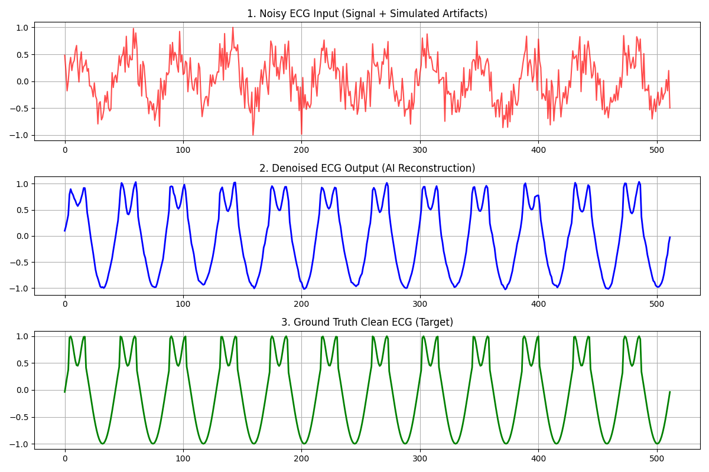

# 🫀 Deep Learning-Based ECG Signal Denoising Using 1D-UNet

[](https://www.python.org/downloads/)
[](https://pytorch.org/)
[](https://opensource.org/licenses/MIT)

An end-to-end Medical AI pipeline designed to remove complex noise artifacts from Electrocardiogram (ECG) signals using deep learning. This repository leverages a customized **1D-UNet** architecture to map corrupted, noisy physiological signals back to their crystalline "Ground Truth" forms, effectively preserving crucial morphological features like the **P-wave, QRS complex, and T-wave**.

---

## 📌 Project Overview & Clinical Context

In clinical settings, ECG signals are heavily susceptible to various forms of environmental and physiological interference, including:
* **Baseline Wander (BW):** Low-frequency noise caused by patient respiration or movement.
* **Electromyographic (EMG) Artifacts:** High-frequency noise from muscle contractions.
* **Powerline Interference:** 50/60 Hz hum from medical equipment.

Traditional mathematical filters (like Butterworth or Notch filters) often distort the amplitude of the QRS complex, which can lead to misdiagnosis. This project utilizes a **Deep Convolutional Autoencoder with Skip Connections (1D-UNet)** to intelligently separate noise from biological signals without sacrificing vital diagnostic data.

---

## ⚡ Key Features

* **Advanced 1D-UNet Architecture:** Combines Downsampling (Encoder) for feature/noise extraction and Upsampling (Decoder) with high-resolution **Skip Connections** to accurately reconstruct micro-temporal ECG features.
* **Realistic Artifact Simulator:** Generates synthetic clean cardiac signals and injects adjustable Signal-to-Noise Ratio (SNR) composite noise (combining white noise and low-frequency baseline drifts).
* **End-to-End PyTorch Pipeline:** Fully modular codebase including custom `Dataset`, `DataLoader`, localized training loops, and an evaluation suite.
* **Automated Visual Reporting:** Automatically plots and saves an analytical comparison chart showing Noisy Input vs. AI Output vs. Clean Ground Truth.

---

## 🏗️ Architecture Design

The model processes the inputs through a symmetrical encoder-decoder structure:

```text
Input (Noisy 1D Signal) 
       │
       ▼
[Conv 1D + BatchNorm + ReLU] ───────────────► (Skip Connection) ──────────────┐
       │ (Max Pool 1D)                                                        │
       ▼                                                                      ▼
[Conv 1D + BatchNorm + ReLU] ──► (Skip Connection) ──┐                 [1D Upsample + Cat]
       │ (Max Pool 1D)                               │                        ▲
       ▼                                             ▼                        │
 [Bottleneck Conv1D] ────────────────────────► [1D Upsample + Cat] ───────────┘
                                                     │
                                                     ▼
                                            [Final 1x1 Conv1D] ──► Output (Clean Signal)
```
## 🚀 Getting Started

### 1. Prerequisites & Installation
Ensure you have Python installed on your system. Then, clone the repository and install the required dependencies:

```bash
git clone [https://github.com/YOUR_USERNAME/ecg-denoising-unet.git](https://github.com/YOUR_USERNAME/ecg-denoising-unet.git)
cd ecg-denoising-unet
pip install torch matplotlib numpy
```
### 2. Repository Structure
The project is structured modularly for easy scalability:

```text
├── dataset.py      # Synthetic ECG generator & PyTorch Dataset setup
├── model.py        # Deep 1D-UNet neural network architecture
├── main.py         # Training loop, evaluation metrics, and plotting pipeline
└── README.md       # Project documentation
```
### 3. Running the Pipeline
To start training the neural network and evaluate its performance, run the main script:

```bash
python main.py
```
## 📊 Results & Visualization

Upon a successful training run, the pipeline automatically evaluates the network on unseen test data and exports a high-resolution diagnostic analysis chart saved as `ecg_denoising_results.png`.

The **1D-UNet** successfully suppresses high-frequency muscle artifacts and flattens out low-frequency baseline drifts while perfectly preserving the critical physiological morphology ($P$-$QRS$-$T$ complexes) required for accurate clinical diagnosis.



### 🔍 Visualization Panel Breakdown

| Panel | Type | Description |
| :--- | :--- | :--- |
| **Top Panel** | **Noisy ECG Input** | The corrupted raw signal, simulating severe patient movement, respiration drift, and equipment interference. |
| **Middle Panel** | **Denoised ECG Output** | The pristine signal reconstructed in real-time by the trained deep learning network. |
| **Bottom Panel** | **Ground Truth** | The ideal, noise-free clinical reference signal used for target verification and loss computation. |

---

## 📈 Future Roadmap

* **[ ] Real-World Data Ingestion:** Integrate the official **PhysioNet MIT-BIH Arrhythmia Database** via the `wfdb` API to replace synthetic generators with authentic clinical waveforms.
* **[ ] Architectural Benchmarking:** Implement an Attention-based **1D Vision Transformer (ViT)** to benchmark temporal sequence modeling against this Convolutional UNet.
* **[ ] Edge Deployment Optimization:** Export the trained PyTorch weights to **ONNX format** and optimize via TensorRT to prepare for deployment on low-power, embedded medical hardware.

---

## 📄 License

This project is licensed under the MIT License - see the [LICENSE](LICENSE) file for details.
